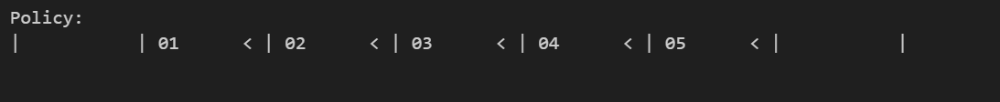
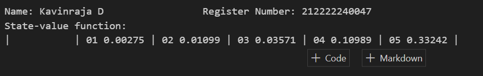
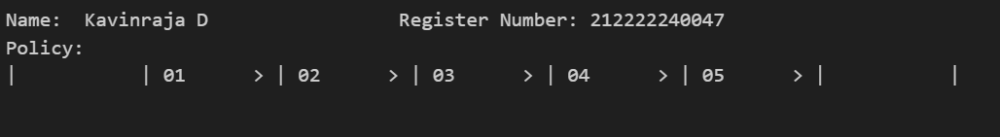
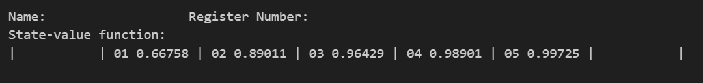

# POLICY ITERATION ALGORITHM

## AIM
To develop a Python program to find the optimal policy for the given MDP using the policy iteration algorithm.

## PROBLEM STATEMENT
The bandit slippery walk problem is a reinforcement learning problem in which an agent must learn to navigate a 7-state environment in order to reach a goal state. The environment is slippery, so the agent has a chance of moving in the opposite direction of the action it takes.
# States
The environment has 7 states:

Two Terminal States: G: The goal state & H: A hole state.
Five Transition states / Non-terminal States including S: The starting state

# Actions
The agent can take two actions:

R: Move right.
L: Move left.

# Transition Probabilities
The transition probabilities for each action are as follows:

50% chance that the agent moves in the intended direction.
33.33% chance that the agent stays in its current state.
16.66% chance that the agent moves in the opposite direction.
For example, if the agent is in state S and takes the "R" action, then there is a 50% chance that it will move to state 4, a 33.33% chance that it will stay in state S, and a 16.66% chance that it will move to state 2.

# Rewards
The agent receives a reward of +1 for reaching the goal state (G). The agent receives a reward of 0 for all other states.

# Graphical Representation

## POLICY ITERATION ALGORITHM

The policy iteration algorithm is a dynamic programming algorithm for finding the optimal policy in a Markov decision process (MDP). The algorithm works by iteratively evaluating and improving a policy until convergence.

The algorithm starts with an arbitrary policy. Then, it iteratively performs two steps:

Policy evaluation: This step computes the value of each state under the current policy. The value of a state is the expected reward that the agent can expect to receive by starting in that state and following the current policy.
Policy improvement: This step finds a new policy that is better than the current policy, if such a policy exists. The new policy is constructed by taking the action that has the highest expected value in each state.
The algorithm terminates when the policy converges, meaning that the policy improvement step can no longer find a better policy.

The following is a pseudocode for the policy iteration algorithm:

initialize policy π
repeat
    evaluate π to get value function v
    π' ← improve_policy(π, v)
until π' = π
The improve_policy function takes a policy and a value function as input and returns a new policy that is better than the input policy, if such a policy exists. The following is a pseudocode for the improve_policy function:

def improve_policy(π, v):
    π' ← {}
    for s in S:
        π'[s] ← argmax_a Q(s, a)
        where Q(s, a) = R(s, a) + γ * v[s']
        where s' is the next state that the agent transitions to by taking action a in state s
    return π'
The policy iteration algorithm is guaranteed to converge to the optimal policy in a finite number of iterations. However, the number of iterations required can be large in practice.

## POLICY IMPROVEMENT FUNCTION
~~~python
def policy_improvement(V, P, gamma=0.9):
    # Initialize a matrix to store action values for each state-action pair
    Q = np.zeros((len(P), len(P[0])), dtype=np.float64)
    # Loop through all states
    for s in range(len(P)):
        # Loop through all possible actions for the current state
        for a in range(len(P[s])):
            # Calculate the expected future rewards (action values) for each action
            for prob, next_state, reward, done in P[s][a]:
                # Update the action value for the current state-action pair
                Q[s][a] += prob * (reward + gamma * V[next_state] * (not done))
    # Determine the new policy by selecting the action with the highest action value
    new_policy = lambda s: {s: a for s, a in enumerate(np.argmax(Q, axis=1))}[s]
    # Return the new policy based on action values
    return new_policy
~~~
## POLICY ITERATION FUNCTION
~~~python
def policy_iteration(P, gamma=0.9, theta=1e-10):
    # Initialize a random policy by selecting random actions for each state
    random_actions = np.random.choice(tuple(P[0].keys()), len(P))
    pi = lambda s: {s: a for s, a in enumerate(random_actions)}[s]
    
    while True:
        # Store the current policy for comparison
        old_pi = {s: pi(s) for s in range(len(P))}
        # Policy Evaluation: Compute the value function V under the current policy
        V = policy_evaluation(pi, P, gamma, theta)
        # Policy Improvement: Improve the policy based on the current value function
        pi = policy_improvement(V, P, gamma)
        # Check if the policy has converged (no change from the previous iteration)
        if old_pi == {s: pi(s) for s in range(len(P))}:
            break
    # Return the final value function and the optimal policy
    return V, pi
~~~

## OUTPUT:
# ADVERSAL POLICY

# Optimal Policy with Gamma = 0.90

## RESULT:
Thus, Python program is developed to find the optimal policy for the given MDP using the policy iteration algorithm.
